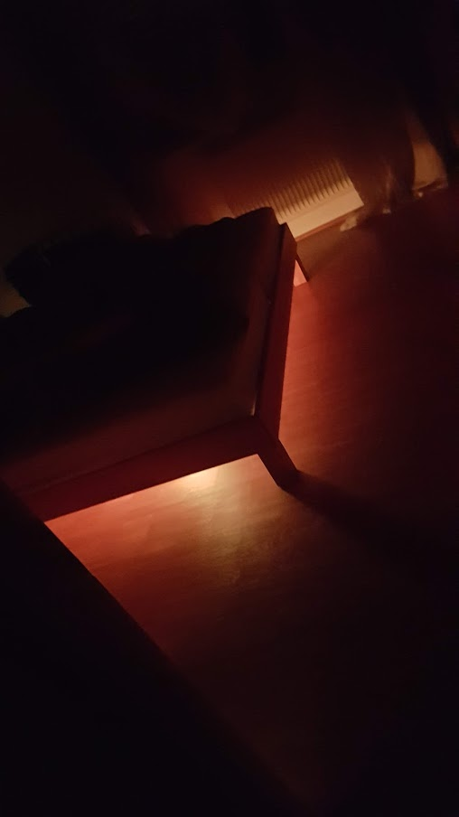
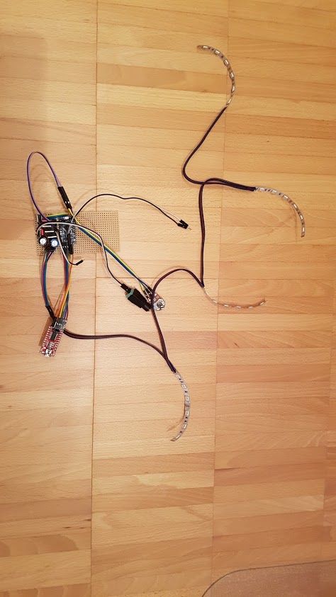
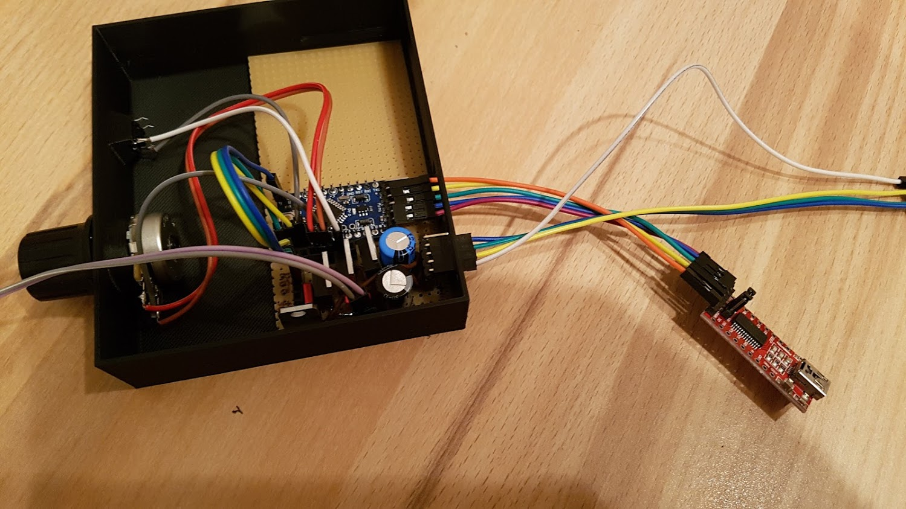
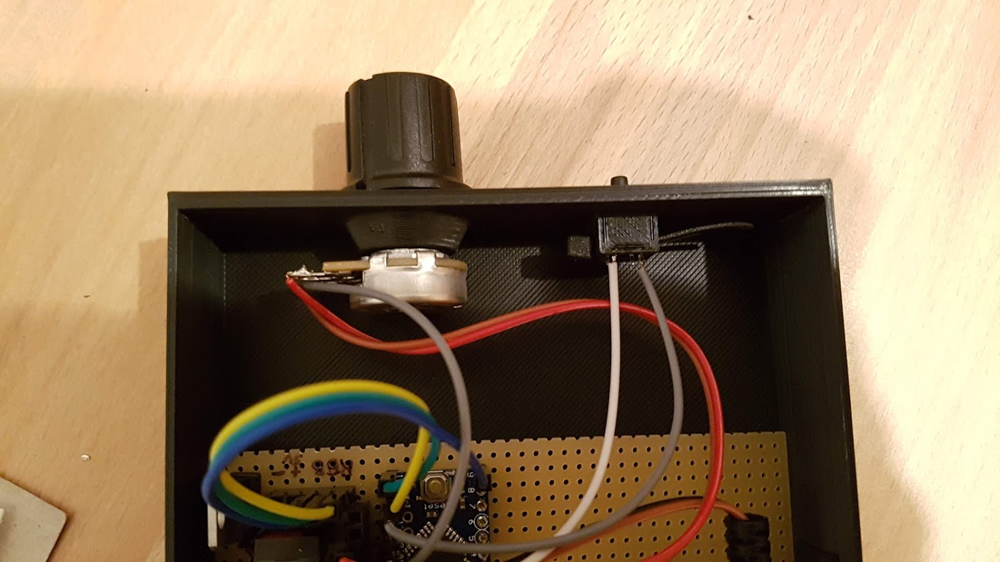
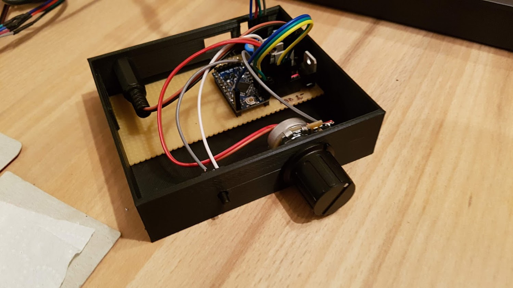

# Bedroom Light Controller

The bedroom light controller controls the brightness and color (rgb) from LED stripes which have the same color. The LED stripes are connected in parallel. I've mounted the LED stripes under my bed in order to get an indirect light. By using the pushbutton I can switch it on or off. If I push the button shortly I can go through a menu which allows me to adjust the colors: red, green, and blue. By using the spincontrol outside the menu I can choose the brightness of the color.

## Interface
1. Input - Power supploy of 12V for LED stripes and arduino.
2. Input - Spincontrol for adjusting brightness and colors.
3. Inout - Pushbutton for switching on and off and for going through a menu which allows to adjust the color.
4. Input - Arduino PINs for FTDI connection in order to be able to adjust and reflash the program of the Atmega. 
5. Output - 4 PINS for 12V + RGB Colors which are connected to the LED stripes.

## Setup
I used an arduino pro mini in order to control the led strips. Between arduino and LED stripes there are transitors. The light brightness is controlled via [PWM](https://en.wikipedia.org/wiki/Pulse-width_modulation).

## 3d Printed Box
I created a housing for the electronics which is also open sourced: ... I published it on www.thingiverse.com. You can explore more details about the box [here](https://www.thingiverse.com/thing:3235540). 

## Pictures
<table><tr>
  <td></td>
  <td></td>
  <td></td>
  <td></td>
  <td></td>
</tr></table>
  
